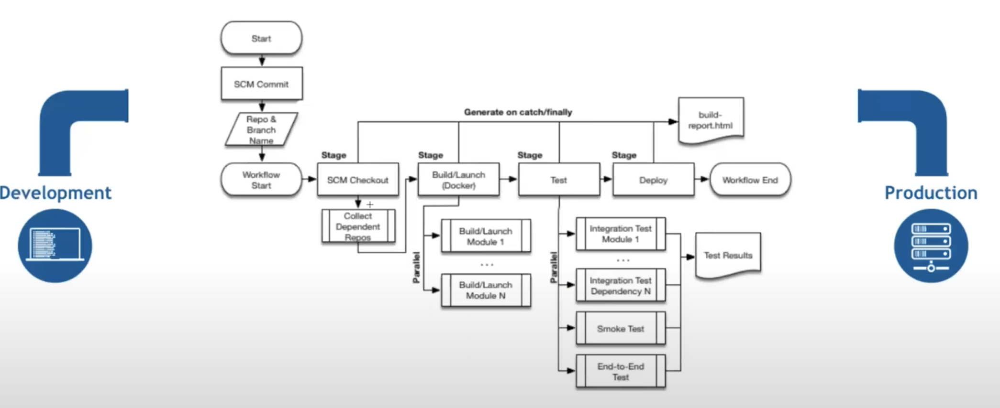
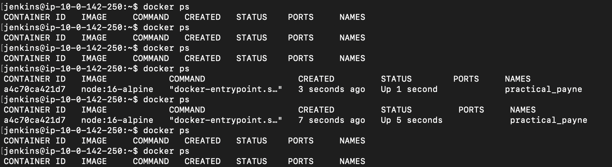

## This is jenkins pipeline

### steps for terminal

1. chmod 400 "aws-login-2024.pem"
2. ssh -i "aws-login-2024.pem" ubuntu@ec2-34-228-229-43.compute-1.amazonaws.com
3. ubuntu@ip-10-0-142-250:~$ docer ps
4. ubuntu@ip-10-0-142-250:~$ sudo su -
5. usermod -aG docker jenkins
6. usermod -aG docker ubuntu
7. systemctl restart docker
8. root@ip-10-0-142-250:~# su - jenkins
9. jenkins@ip-10-0-142-250:~$ docker ps
   (If the jenkins is running this will show what is happening)

